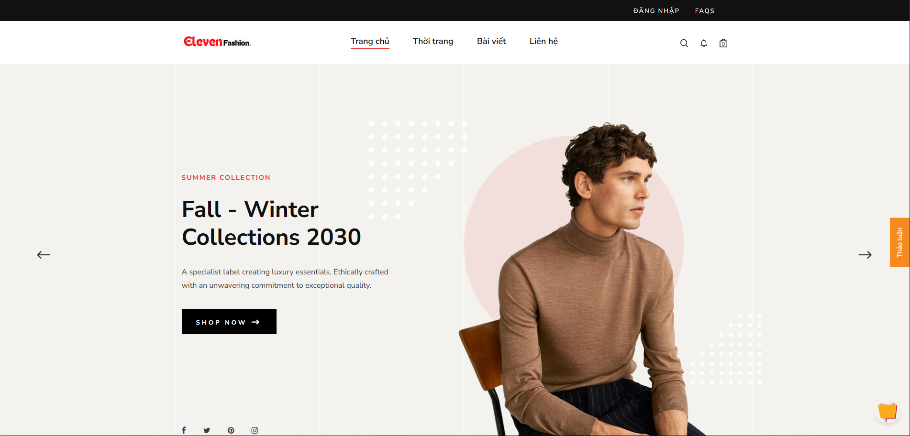
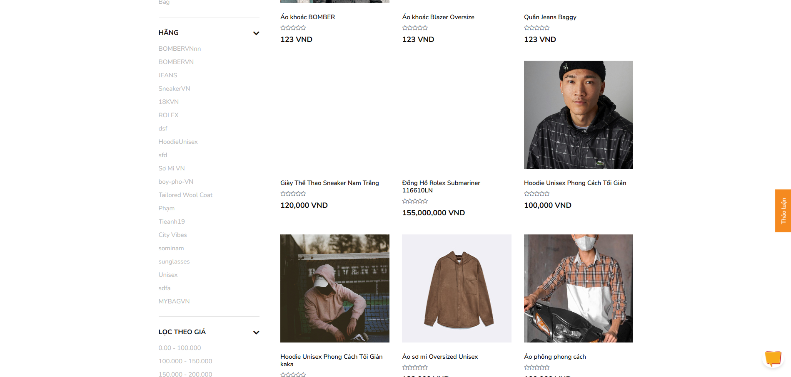
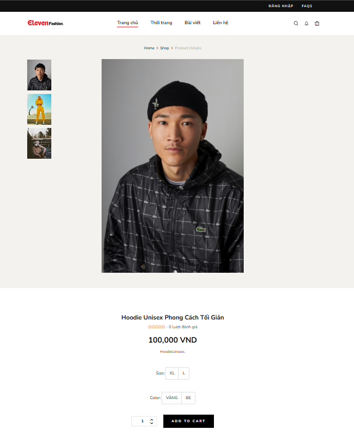
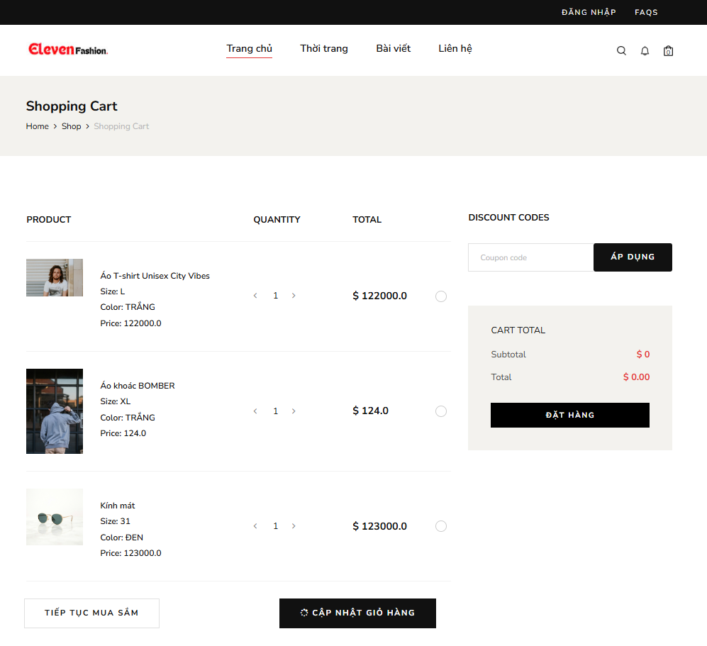

# ĐỀ TÀI

## TRANG WEB BÁN HÀNG THỜI TRANG - Nhóm 14

### Thành viên thực hiện:
- **Nguyễn Đức Sang** - 22110404
- **Lương Quang Thịnh** - 22110428
- **Nguyễn Công Quý** - 22110403
- **Phạm Tiến Anh** - 22110282
- **Nguyễn Hoàng Thùy Linh** - 22110364

---

# 🚀 Hướng Dẫn Cài Đặt và Chạy Dự Án

## 🛠 Yêu Cầu Hệ Thống

Trước khi chạy dự án, hãy đảm bảo bạn đã cài đặt các công cụ sau:

- **Docker** (phiên bản mới nhất) - [📥 Tải Docker](https://www.docker.com/get-started)

## 📥 Clone Repository (Sao Chép Mã Nguồn)

Chạy lệnh sau để lấy mã nguồn từ GitHub:

```sh
git clone https://github.com/Tcrow06/BMW-HK2-2024-2025
cd BMW-HK2-2024-2025
```

- `git clone`: Sao chép toàn bộ mã nguồn từ kho GitHub về máy.
- `cd BMW-HK2-2024-2025`: Di chuyển vào thư mục dự án.

## 🐳 Chạy Dự Án bằng Docker

### Tạo Image và Chạy Container

```sh
docker-compose up -d --build
```

- `docker-compose up`: Khởi động ứng dụng dựa trên file `docker-compose.yml`.
- `-d`: Chạy ứng dụng ở chế độ nền (background mode).
- `--build`: Xây dựng lại image trước khi chạy container.

## 🌍 Truy Cập Ứng Dụng

Sau khi chạy thành công, bạn có thể truy cập ứng dụng tại:

```
http://localhost:8080
```

## ⚠ Xử Lý Sự Cố

- Kiểm tra Docker có đang chạy không trước khi thực hiện các lệnh Docker.
---

## 🖼 Hình Ảnh Minh Họa

Dưới đây là một số hình ảnh về giao diện của dự án:


*Giao diện trang chủ của ứng dụng.*


*Danh sách sản phẩm được hiển thị trên website.*


*Giao diện chi tiết sản phẩm.*


*Giao diện giỏ hàng khi người dùng thêm sản phẩm.*

... Còn nhiều giao diện khác nữa 

✅ **Cảm ơn bạn đã sử dụng phần mềm! Chúc bạn cài đặt thành công!** 🚀

